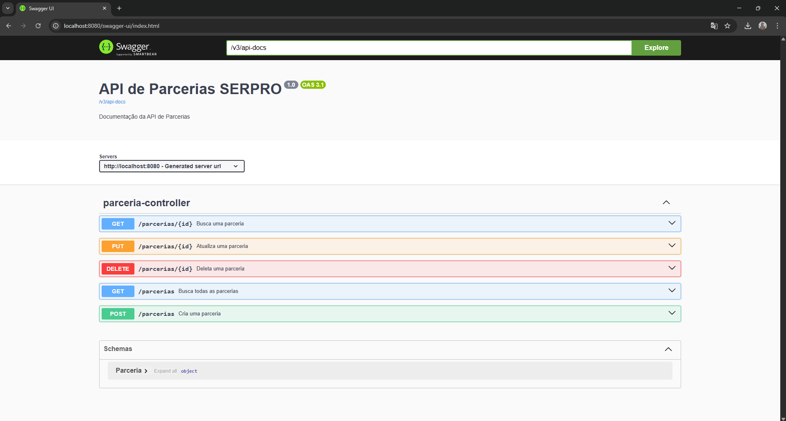

# 🤝 Parcerias SERPRO

Bem-vindo ao Parcerias SERPRO!

Eu sou o José Henrique, estagiário no departamento de Governança de Inovação do SERPRO. Durante minha jornada profissional, percebi a necessidade de melhorar o gerenciamento das parcerias e convênios divulgados no portal do SERPRO, que antes eram organizados manualmente em planilhas. Essa abordagem causava dificuldades para visualizar todas as parcerias ou pesquisar por uma específica de forma eficiente.

Com isso, decidi criar este projeto como uma API RESTful utilizando Java e Spring Boot, com o objetivo de otimizar o processo de cadastro, busca, atualização e deleção dessas parcerias. A ideia é substituir o uso de planilhas por uma solução mais ágil, permitindo que os usuários acessem, gerenciem e encontrem as informações de maneira mais prática e organizada.

Além disso, foi feito o deploy do projeto no Render e integrado ao frontend em Next.js, criando assim uma aplicação fullstack.
## 📌 Funcionalidades

- Criar uma nova parceria
- Listar todas as parcerias
- Buscar parceria por ID
- Atualizar parceria existente
- Deletar parceria por ID

## 🚀 Tecnologias Utilizadas

- Java 17
- Spring Boot 3
- Spring Data JPA
- PostgreSQL
- Docker
- Springdoc OpenAPI (Swagger UI)
- Render

## ⚙️ Como Executar o Projeto 

### Render
- A API foi publicada no [Render](https://render.com/) e integrada a um banco de dados PostgreSQL.

### 1. Executando o projeto localmente (Clone o repositório)

```bash
git clone https://github.com/jhenriquedsm/parcerias-serpro.git
cd parcerias-serpro 
```

### 2. Configurar o banco de dados PostgreSQL

#### Crie o banco de dados:
```bash
CREATE DATABASE parcerias_serpro;
```

### 3. Atualize o application.properties

#### No arquivo src/main/resources/application.properties, configure:
```bash
spring.jpa.properties.hibernate.dialect=org.hibernate.dialect.PostgreSQLDialect
spring.datasource.username=seu_usuario
spring.datasource.password=sua_senha
spring.datasource.url=jdbc:postgresql://localhost:5432/seu_banco
spring.jpa.generate-ddl=true
spring.jpa.hibernate.ddl-auto=update
spring.jpa.show-sql=true
```

### 4. Execute a aplicação

#### Você pode executar com:
```bash
./mvnw spring-boot:run
```
#### A API estará disponível em: http://localhost:8080/parcerias

## 🧪 Testando a API
#### Você pode testar os endpoints usando o Swagger: http://localhost:8080/swagger-ui.html

### Exemplo de Requisições: 
#### Criar parceria
```bash
POST /parcerias
Content-Type: application/json

{
  "title": "Parceria com o Governo Federal",
  "url": "https://www.serpro.gov.br/parcerias/parceria-exemplo",
  "newsDate": "2025-04-18"
}
```

#### Atualizar parceria
```bash
PUT /parcerias/{id}
Content-Type: application/json

{
  "title": "Parceria com o Governo Federal Exemplo",
  "url": "https://www.serpro.gov.br/parcerias/parceria-exemplo",
  "newsDate": "2025-04-17"
}
```

#### Buscar parcerias
```bash
GET /parcerias/

Exemplo de resposta (200 OK):
[
  {
    "id": 1,
    "title": "Parceria com o Governo Federal",
    "url": "https://www.serpro.gov.br/parcerias/parceria-exemplo",
    "newsDate": "2025-04-18"
  },
  {
    "id": 2,
    "title": "Parceria com o Governo Federal Exemplo",
    "url": "https://www.serpro.gov.br/parcerias/parceria-exemplo",
    "newsDate": "2025-04-17"
  }
]
```

#### Buscar parceria por id
```bash
GET /parcerias/{id}

Exemplo de resposta (200 OK):
[
  {
    "id": 1,
    "title": "Parceria com o Governo Federal",
    "url": "https://www.serpro.gov.br/parcerias/parceria-exemplo",
    "newsDate": "2025-04-18"
  }
]
```

#### Deletar parceria por id
```bash
DELETE /parcerias/{id}

Exemplo de resposta (204 NoContent):
(no body - a resposta está vazia)
```

## 📂 Estrutura do Projeto
```bash
src/main/java/jhenriquedsm/parcerias_serpro
├── controllers
├── model
├── repositories
├── services
├── exceptions
└── config
```

## 📝 Licença
Desenvolvido com ❤️ por **José Henrique**  
[🔗 LinkedIn](https://www.linkedin.com/in/jhenriquedsm) | [🐙 GitHub](https://github.com/jhenriquedsm)
